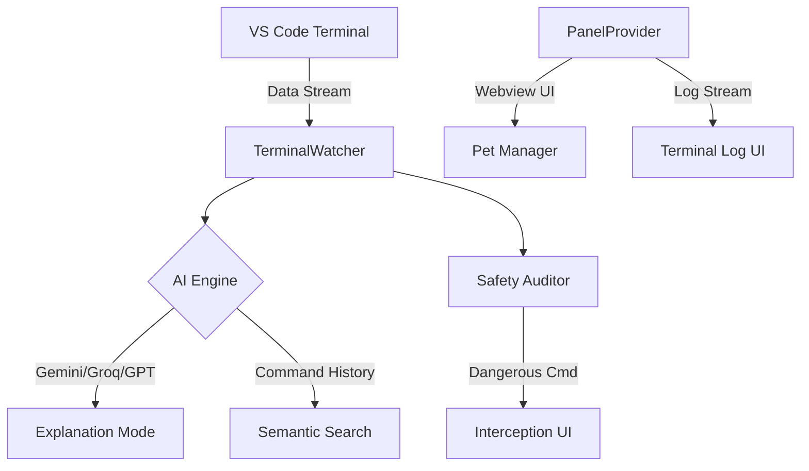

  
  
  <h1>🐱 Terminal Buddy</h1>
  
<b>A Knowledgeable Companion for Your VS Code Terminal</b>

  

    
    
    
    
  

  

    <i>Stop fighting with cryptic terminal errors. Get plain-English explanations, smart command suggestions, and a little mascot companion, all inside VS Code.</i>
  

---

## 🚀 Why Terminal Buddy?

Terminal output is often cluttered with jargon-heavy error messages and context that’s hard to parse.
**Terminal Buddy acts as a bridge between raw CLI and your development workflow.**

- **Instant Clarity**: Explains failures without leaving VS Code.
- **Proactive Guidance**: Suggests next steps (missing dependencies, git fixes).
- **Reduced Anxiety**: Checks for dangerous operations (like `rm -rf`) before they run.
- **Engagement**: A companion pet mascot that grows with your skills.

---

## 🏗️ Project Architecture

Terminal Buddy uses a modular architecture for reliability and performance. For deeper technical details, see the [Architecture Documentation](docs/architecture.md).

---

## ✨ Key Features

- 🛡️ **Security Audit**: Evaluates command intent to warn against dangerous sequences.
- 🪄 **Magic CLI Prompt**: Natural language to CLI command generation.
- 🌳 **Human-Readable Git tree**: Sidebar visualization of repository modifications.
- 🐱 **Interactive Buddy**: Choose from a Cat, Dog, Robot, or Ghost.
- 🔎 **Semantic Search**: Find command history using natural language.
- 📋 **Live Command Log**: Interactive monitoring of terminal activity.

Detailed feature breakdown available in [Features Documentation](docs/features.md).

---

## 🛠️ Instructions (Quick Start)

### 1. Installation
1. Search for **Terminal Buddy** in the VS Code Marketplace and click Install.
2. Alternatively, clone this repo and run `npm install` (see Development below).

### 2. Configuration
1. Open Terminal Buddy from the Activity Bar icon.
2. Click the ⚙️ (Settings) icon.
3. Enter your **AI Provider API Key** (Gemini, OpenAI, or Groq).
4. Select your preferred **Mascot Companion**.

### 3. Basic Usage
- **Autocomplete**: Start typing in the terminal for AI-powered completions.
- **Error Fix**: If a command fails, click the mascot or the log entry to see the fix.
- **Magic Prompt**: Use the input box in the Explorer to generate commands.

### 4. Development Loop
1. `git clone https://github.com/AmanTShekar/zenith-terminal-buddy.git`
2. `npm install`
3. Press `F5` to start debugging.
4. Run `npm run verify` before submitting PRs.

---

## 🤝 Contributing

We love contributions! Please read our [CONTRIBUTING.md](CONTRIBUTING.md) to get started.

---

## 🔒 Security & Privacy

> [!IMPORTANT]
> - **Direct Communication**: Data is sent directly from your machine to YOUR AI provider.
> - **No Intermediary**: We do not store or mirror your terminal data.
> - **Credentials**: API keys are stored securely in the VS Code Secret Storage (OS Keychain).

---

## ⚖️ License

Distributed under the **MIT License**. See `LICENSE` for more information.

---

  <i>Built with ❤️ for developers everywhere.</i>

